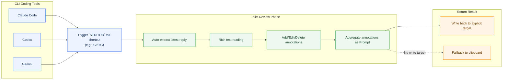

# cliV

**[中文版](README.zh-CN.md)**

> ### Tame the AI Flood. Review with precision.
> 
> **A desktop reviewer crafted for command-line invocation.** Escape the flood of terminal text with a single shortcut: read long AI replies comfortably in rich text, make precise selection-based annotations, and write the aggregated prompt right back to your target workflow.

_Full animated preview for GitHub. Click to open the MP4 demo on GitHub._

## Why cliV?

AI coding agents (Codex, Claude Code, Gemini CLI) produce long, structured replies — but you're reading them in a terminal. That's fine for 20 lines, painful for 500.

**cliV** can be set as an external editor for Claude Code, Codex, and Gemini, invoked via shortcut, enabling review, annotation, prompt return, and history functions:

- **Review** — full Markdown + Mermaid diagram rendering, no more plain text
- **Annotate** — select exact passages to add comments instead of writing vague follow-ups
- **Write back** — write back to the active write target when available, fall back to clipboard otherwise
- **Open** — also open local Markdown files for standalone review

## Supported Agents

- [Codex](https://github.com/openai/codex)
- [Claude Code](https://docs.anthropic.com/en/docs/claude-code)
- [Gemini CLI](https://github.com/google-gemini/gemini-cli)

Hook commands, path rules, launch behavior, and debugging are documented in the guide links below.

## Installation and Configuration

Please use the dedicated guide documents:
- [Install Guide](docs/install-guide.md)
- [Advanced Integration & Debugging Guide](docs/integrations.md)

What each guide covers:

- `Install Guide`: official install paths, `$EDITOR`, basic hook setup, verification, and uninstall
- `Advanced Integration & Debugging Guide`: non-default executable paths, launch semantics, reply-cache lookup rules, and manual debugging

For source builds and developer workflows, see the additional documents under [`docs/`](docs/) and the contributor notes in [`AGENTS.md`](AGENTS.md).

## Quick Start

1. Start your AI agent (Codex, Claude Code, or Gemini CLI)
2. Have a conversation that generates a long reply
3. Trigger the agent's `$EDITOR` flow (commonly `Ctrl+G`, but depends on agent / config)
4. cliV opens with the agent's latest reply rendered as rich Markdown
5. Select text → annotate → aggregate → write back or copy the result

## Workflow

## Features

- 📖 **Rich Markdown rendering** — headings, code blocks, tables, Mermaid diagrams
- ✏️ **Selection-based annotations** — highlight passages and add comments (in-text highlights rely on CSS Highlight API)
- 📋 **Write-back flow** — aggregate annotations into a prompt, then write back or copy
- 🔄 **Multi-agent support** — best-effort auto-detection of Codex / Claude / Gemini; force with `CLIV_AGENT`
- 📂 **Open local Markdown** — review cached replies or open `.md` files directly with safe review-only defaults
- 🎛️ **Unified settings** — manage Reading, Prompts, and Shortcuts from one settings surface backed by `~/.cliv/config.toml`

## Tech Stack

- **Frontend**: React 19 + Vite 7 + Zustand + TailwindCSS 4
- **Backend**: Tauri v2 (Rust)
- **Rendering**: react-markdown + remark-gfm + Mermaid

## Roadmap

- [ ] Virtual scrolling for large documents
- [ ] Diff / suggestion mode
- [x] Standalone review polish (`cliv <file.md>` now stays review-only by default)
- [x] Cross-platform builds (macOS, Windows)
- [ ] Plugin system for custom agents
- [x] Review history (project-grouped archives with read-only replay)
- [ ] Favorites
- [ ] Iterative editing mode

## Acknowledgments

- [Linux DO](https://linux.do/) — Learn AI, go LinuxDO!

## License

MIT
