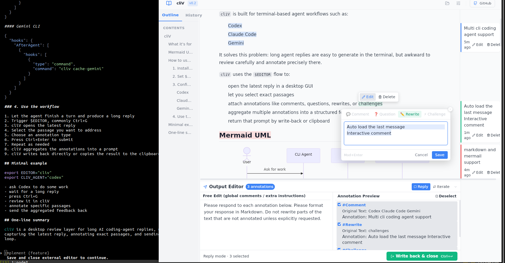
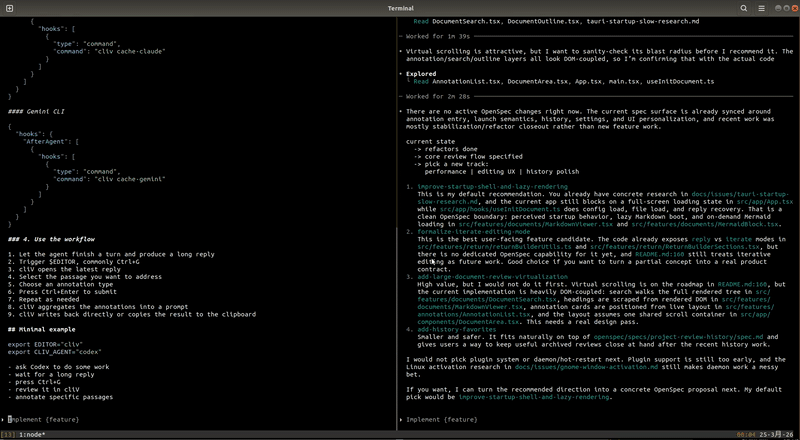
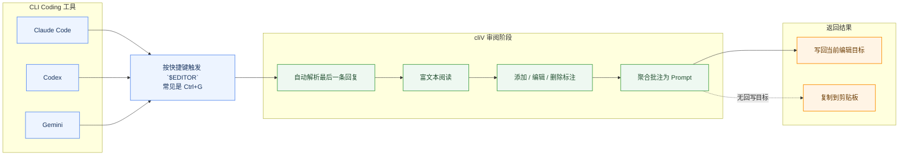

# cliV

**[English](README.md)**

> ### Tame the AI Flood. Review with precision.
> 
> **专为命令行唤起打造的桌面端审阅器。** 在这里只需快捷键操作，即可逃离终端的文本狂潮，舒适地进行富文本阅读、精准选区批注，并将聚合后的提示词一键打回目标工作流。

_GitHub 中显示为完整动图预览；点击可在 GitHub 中打开 MP4 演示。_

## 为什么需要 cliV？

AI 编程 Agent（Codex、Claude Code、Gemini CLI）经常产出长篇结构化回复——但你只能在终端里阅读。20 行还行，500 行就很痛苦了。

**cliV** 可以设置成 Claude Code、Codex、Gemini 的外部编辑器，快捷键调用，开始评审、批注，提示词返回、历史记录等功能。

- **审阅** — 完整的 Markdown + Mermaid 图表渲染，告别纯文本
- **批注** — 精确选中段落添加评论，不再写模糊的追问
- **写回** — 有写回目标时直接写回，没有时回退到剪贴板
- **打开** — 也可以直接打开本地 Markdown 文件做独立审阅

## 支持的 Agent

| Agent | 集成方式 | Hook 命令 |
|---|---|---|
| [Codex](https://github.com/openai/codex) | `notify` hook | `cliv cache-codex` |
| [Claude Code](https://docs.anthropic.com/en/docs/claude-code) | `Stop` hook | `cliv cache-claude` |
| [Gemini CLI](https://github.com/google-gemini/gemini-cli) | `AfterAgent` hook | `cliv cache-gemini` |

`cache-codex` 通过命令行参数接收 JSON；`cache-claude` 和 `cache-gemini` 通过 stdin 读取 JSON。Gemini 还依赖 `GEMINI_SESSION_ID`。

## 安装、配置与说明

请参阅独立的指南文档：
- [安装指南 (Install Guide)](docs/install-guide.zh-CN.md)
- [Agent 集成指南 (Integrations)](docs/integrations.zh-CN.md)

这些文档详细说明了如何下载、构建 cliV，如何配置 `$EDITOR` 以及在不同 AI Agent（Codex、Claude Code、Gemini CLI）中的集成方式和各项环境配置（如 `config.toml`）。架构与贡献说明也已移至各项专项文档。

## 快速上手

1. 启动你的 AI Agent（Codex、Claude Code 或 Gemini CLI）
2. 进行一轮对话，让 Agent 产生长回复
3. 触发 Agent 的 `$EDITOR` 流程（常见是 `Ctrl+G`，但取决于 Agent / 配置）
4. cliV 弹出窗口，展示 Agent 最新回复的富文本渲染
5. 选中文本 → 添加批注 → 汇总 → 写回或复制结果

## 工作流

## 功能特性

- 📖 **富文本 Markdown 渲染** — 标题、代码块、表格、Mermaid 图表
- ✏️ **基于选区的批注** — 高亮段落并添加评论（正文高亮依赖 CSS Highlight API）
- 📋 **写回流程** — 将批注汇总为提示词，然后写回或复制
- 🔄 **多 Agent 支持** — 尽力自动识别 Codex / Claude / Gemini，也可用 `CLIV_AGENT` 强制指定
- 📂 **打开本地 Markdown** — 既能审阅缓存回复，也能直接打开 `.md` 文件，且默认按只读审阅处理
- 🎛️ **统一设置** — 在同一个设置面板中管理 Reading、Prompts、Shortcuts、Integrations，并统一持久化到 `~/.cliv/config.toml`

## 技术栈

- **前端**：React 19 + Vite 7 + Zustand + TailwindCSS 4
- **后端**：Tauri v2（Rust）
- **渲染**：react-markdown + remark-gfm + Mermaid

## 路线图

- [ ] 大文档虚拟滚动
- [ ] Diff / 建议模式
- [x] 独立审阅完善（`cliv <file.md>` 默认只读审阅，支持安全回退）
- [x] 跨平台构建（macOS、Windows）
- [ ] 自定义 Agent 插件系统
- [x] 审阅历史（按项目分组归档，并支持只读回放）
- [ ] 收藏夹
- [ ] 迭代编辑模式

## 致谢

- [Linux DO](https://linux.do/) — 学AI，上L站！

## 许可证

MIT
