# cliV — Architecture & Feature Showcase

> **A desktop reviewer launched from the CLI, for reading long AI agent replies and Markdown drafts.**

This document presents a comprehensive walkthrough of cliV's internal architecture, data flows, and feature set. It is intended to demonstrate the project's rendering capabilities—including headings, rich text, Mermaid diagrams, code blocks, tables, blockquotes, and more.

---

## Table of Contents

1. [Overview](#overview)
2. [System Architecture](#system-architecture)
3. [Agent Integration Pipeline](#agent-integration-pipeline)
4. [CLI Parsing & Mode Dispatch](#cli-parsing--mode-dispatch)
5. [Reply Caching Subsystem](#reply-caching-subsystem)
6. [Agent Detection Algorithm](#agent-detection-algorithm)
7. [Frontend Architecture](#frontend-architecture)
8. [State Management Deep Dive](#state-management-deep-dive)
9. [Annotation Workflow](#annotation-workflow)
10. [Review History](#review-history)
11. [Write-back & Return Flow](#write-back--return-flow)
12. [Data Model Reference](#data-model-reference)
13. [Security & Reliability](#security--reliability)
14. [Roadmap & Vision](#roadmap--vision)

---

## Overview

AI coding agents like **Codex**, **Claude Code**, and **Gemini CLI** produce long, structured replies—but you're reading them in a terminal. That's fine for 20 lines, painful for 500+.

**cliV** bridges this gap by acting as a desktop-grade Markdown reviewer that integrates seamlessly into the agent's `$EDITOR` flow:

| Capability | Description |
|:---|:---|
| 📖 Rich Rendering | Headings, code blocks, tables, Mermaid diagrams |
| ✏️ Annotations | Select exact passages, add inline comments |
| 📋 Write-back | Aggregate annotations → write back or copy |
| 🔄 Multi-agent | Auto-detect Codex / Claude / Gemini |
| 🗂️ Sessions | Persist review snapshots locally |
| 🎛️ Reading Settings | One surface for theme, font size, layout memory, and reading presets |

### Design Philosophy

> *"The right tool for reading should be as powerful as the tool that wrote it."*

cliV follows three core principles:

1. **Zero-friction integration** — drop-in `$EDITOR` replacement, no configuration files needed
2. **Defensive reliability** — atomic writes, graceful fallbacks, defensive error handling
3. **Agent-aware intelligence** — auto-detects which agent launched it and finds the correct reply

---

## System Architecture

The application is split into a **Rust backend** (Tauri v2) and a **React frontend**, communicating via Tauri's IPC bridge.

### High-Level Component Diagram

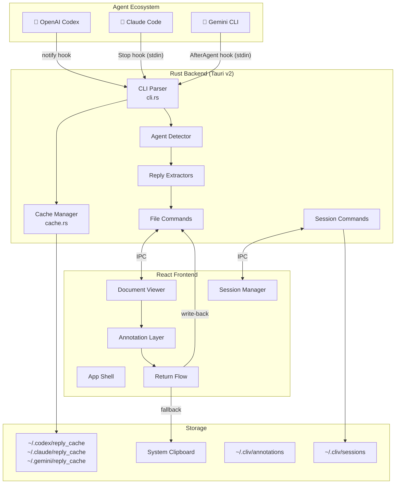

### Layer Responsibilities

```mermaid
graph LR
    subgraph "Layer 1: CLI Entry"
        A1["Argument Parsing"]
        A2["Mode Dispatch"]
        A3["Env Detection"]
    end

    subgraph "Layer 2: Core Services"
        B1["Agent Detection"]
        B2["Reply Extraction"]
        B3["Cache Read/Write"]
        B4["File I/O"]
    end

    subgraph "Layer 3: IPC Bridge"
        C1["Tauri Commands"]
        C2["Event System"]
    end

    subgraph "Layer 4: UI Layer"
        D1["Document Rendering"]
        D2["Annotation System"]
        D3["Session UI"]
        D4["Theme Engine"]
    end

    A1 --> A2
    A2 --> A3
    A3 --> B1
    B1 --> B2
    B2 --> B3
    B3 --> B4
    B4 --> C1
    C1 --> C2
    C2 --> D1
    D1 --> D2
    D2 --> D3
    D3 --> D4
```

---

## Agent Integration Pipeline

Each supported AI agent has a unique hook mechanism. cliV normalizes these into a unified cache format.

### Hook Configuration Matrix

| Agent | Hook Type | Trigger | Data Source | Cache Key |
|:---|:---|:---|:---|:---|
| Codex | `notify` | `agent-turn-complete` | CLI argument (JSON) | `thread_id` + PID |
| Claude Code | `Stop` | `Stop` event | stdin (JSON) | `session_id` + PID |
| Gemini CLI | `AfterAgent` | After agent response | stdin (JSON) | `GEMINI_SESSION_ID` + PID |

### Integration Setup Examples

**Codex** — Add to `~/.codex/config.yaml`:

```yaml
notify:
  - "cliv cache-codex '$1'"
```

**Claude Code** — Add to `~/.claude/settings.json`:

```json
{
  "hooks": {
    "Stop": [
      {
        "matcher": "",
        "hooks": [
          {
            "type": "command",
            "command": "cliv cache-claude"
          }
        ]
      }
    ]
  }
}
```

**Gemini CLI** — Add to `~/.gemini/settings.json`:

```json
{
  "hooks": {
    "AfterAgent": [
      {
        "cwd": ".",
        "command": "cliv cache-gemini"
      }
    ]
  }
}
```

---

## CLI Parsing & Mode Dispatch

cliV uses a hand-rolled CLI parser (no external crate dependencies) to keep the binary small and startup fast.

### Mode Decision Tree

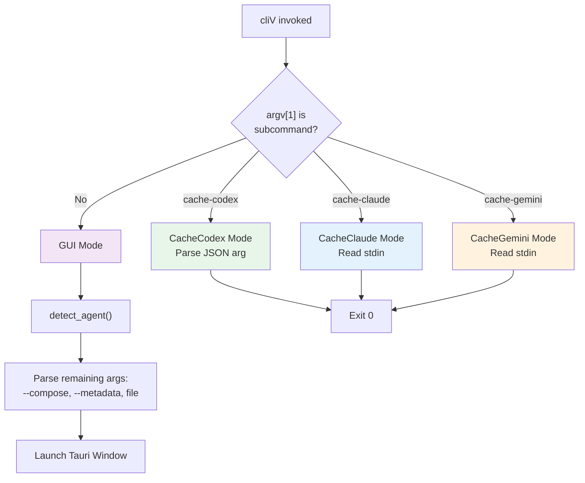

### CLI Data Structures

```rust
/// How cliV was invoked.
#[derive(Debug, Clone)]
pub enum CliMode {
    /// Launch the Tauri GUI (default).
    Gui,
    /// Cache a Codex reply: `cliv cache-codex '<json>'`
    CacheCodex(String),
    /// Cache a Claude reply (stdin): `cliv cache-claude`
    CacheClaude,
    /// Cache a Gemini reply (stdin): `cliv cache-gemini`
    CacheGemini,
}

/// CLI arguments for GUI mode.
#[derive(Debug, Clone, Serialize)]
#[serde(rename_all = "camelCase")]
pub struct CliArgs {
    pub compose_path: Option<String>,
    pub metadata_path: Option<String>,
    pub file_path: Option<String>,
    pub agent: Option<String>,
}
```

### Argument Parsing Logic

```rust
// Parse positional and named arguments
let mut i = 1;
while i < argv.len() {
    match argv[i].as_str() {
        "--metadata" => {
            args.metadata_path = Some(argv[i + 1].clone());
            i += 2;
        }
        "--compose" => {
            args.compose_path = Some(argv[i + 1].clone());
            i += 2;
        }
        arg if !arg.starts_with('-') => {
            // First positional arg = file path
            if args.file_path.is_none() {
                args.file_path = Some(arg.to_string());
                // Also set as compose target if not explicit
                if args.compose_path.is_none() {
                    args.compose_path = Some(arg.to_string());
                }
            }
            i += 1;
        }
        _ => { i += 1; }
    }
}
```

---

## Reply Caching Subsystem

The cache system ensures that agent replies survive the transition between the hook (headless) and the GUI (interactive) phases.

### Cache Write Flow (Atomic)

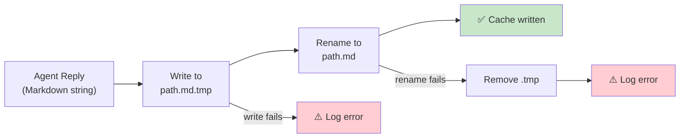

### Atomic Write Implementation

```rust
/// Atomic write: write to .tmp then rename.
fn atomic_write_cache(path: &PathBuf, content: &str) {
    let tmp = path.with_extension("md.tmp");

    if let Some(parent) = path.parent() {
        let _ = fs::create_dir_all(parent);
    }

    if fs::write(&tmp, content).is_ok() {
        if fs::rename(&tmp, path).is_ok() {
            log(&format!("  cache: wrote {} bytes → {}",
                content.len(), path.display()));
        } else {
            log(&format!("  cache: rename failed for {}",
                path.display()));
            let _ = fs::remove_file(&tmp);
        }
    } else {
        log(&format!("  cache: write failed for {}",
            tmp.display()));
    }
}
```

### Cache Directory Layout

```
~/.codex/
└── reply_cache/
    ├── <agent_pid>.md        # Indexed by process PID
    └── <agent_pid>.meta.json # Stores the real Codex thread ID

~/.claude/
└── reply_cache/
    ├── <session_id>.md       # Indexed by Claude session ID
    └── <agent_pid>.md        # Indexed by process PID

~/.gemini/
└── reply_cache/
    ├── <session_id>.md       # Indexed by Gemini session ID
    └── <agent_pid>.md        # Indexed by process PID
```

### Codex PID-Key Cache Strategy

Codex writes reply content under a single pid-keyed cache file and stores the real thread ID in the sidecar metadata file:

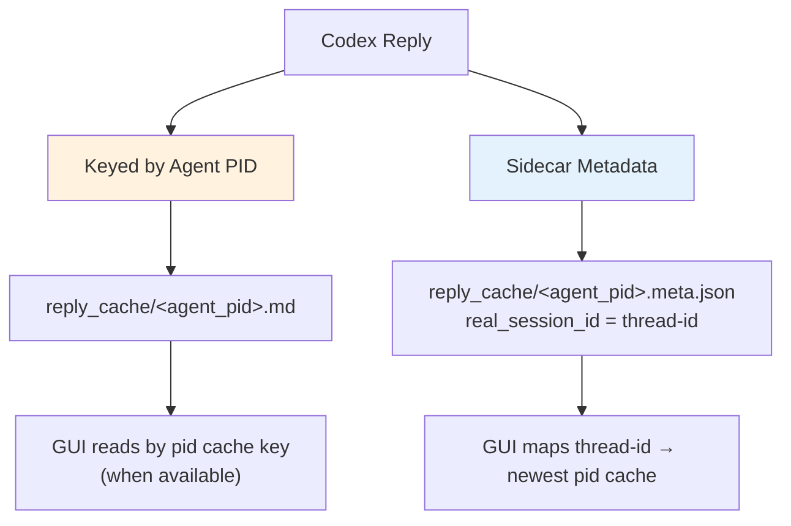

Claude and Gemini still keep both session-id and pid-keyed cache files.

> **Why pid + metadata for Codex?** The pid-keyed cache gives cliV a deterministic lookup key during GUI launch, while the sidecar metadata preserves the real thread ID for SQLite-based recovery.

---

## Agent Detection Algorithm

cliV auto-detects which AI agent launched it using a cascading strategy that inspects environment variables and the process tree.

### Detection Priority Chain

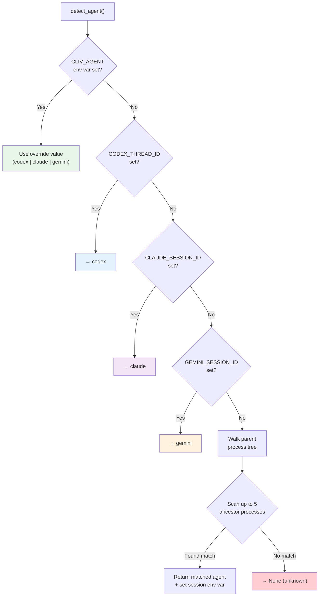


### Cross-Platform Implementation

```rust
// Linux: uses /proc filesystem
#[cfg(target_os = "linux")]
fn detect_agent_from_parent_process() -> Option<String> {
    let mut pid = std::os::unix::process::parent_id();
    for level in 0..5 {
        if pid <= 1 { break; }
        let comm = std::fs::read_to_string(
            format!("/proc/{}/comm", pid)
        )?.trim().to_lowercase();
        if let Some(agent) = match_agent_name(&comm) {
            return handle_agent_match(agent, pid, level);
        }
        // Walk up via /proc/PID/stat → PPID
        pid = extract_ppid_from_stat(pid)?;
    }
    None
}

// macOS: uses libproc + ps
#[cfg(target_os = "macos")]
fn detect_agent_from_parent_process() -> Option<String> {
    // Uses proc_name() FFI + `ps -o ppid=`
    // ...
}

// Windows: uses ToolHelp32 API snapshot
#[cfg(target_os = "windows")]
fn detect_agent_from_parent_process() -> Option<String> {
    // Uses CreateToolhelp32Snapshot + Process32FirstW
    // Builds full PID → (name, ppid) map, then walks
    // ...
}
```

---

## Frontend Architecture

The React frontend is organized into feature modules with a shared state layer.

### Module Dependency Graph

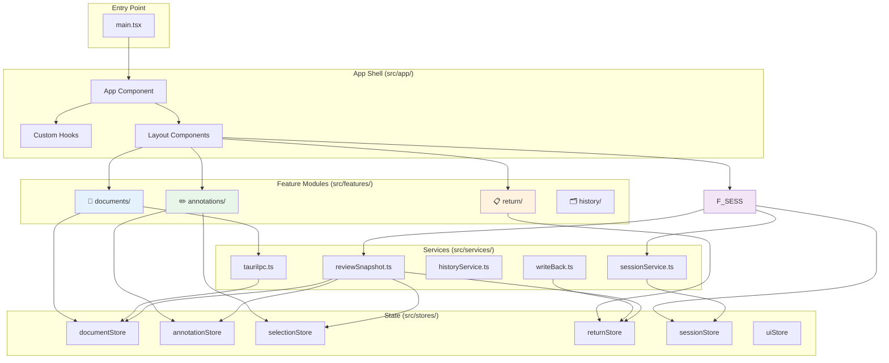

### Component Tree

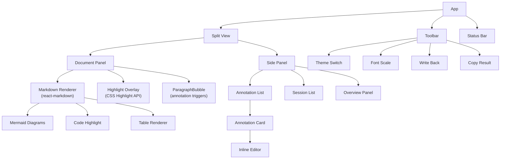

---

## State Management Deep Dive

cliV uses **Zustand** for state management with 6 independent stores, each responsible for a single domain.

### Store Topology

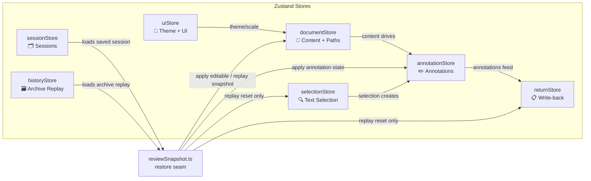

### Document Store

```typescript
interface DocumentState {
  replyContent: string | null;    // The agent's reply (Markdown)
  composeContent: string | null;  // Editor compose content
  composePath: string | null;     // File path for write-back
  replyPath: string | null;       // Path to cached reply
  documentId: string;             // Unique document identifier
  isLoading: boolean;
  error: string | null;

  setDocument: (opts: {
    reply?: string | null;
    compose?: string | null;
    composePath?: string | null;
    replyPath?: string | null;
    documentId?: string;
  }) => void;
  setLoading: (loading: boolean) => void;
  setError: (error: string | null) => void;
}
```

### Annotation Store

```typescript
interface AnnotationState {
  annotations: Annotation[];
  activeAnnotationId: string | null;
  hoveredAnnotationId: string | null;
  editingAnnotationId: string | null;

  addAnnotation: (annotation: Annotation) => void;
  updateAnnotation: (id: string, patch: Partial<Annotation>) => void;
  removeAnnotation: (id: string) => void;
  setActiveAnnotation: (id: string | null) => void;
  setHoveredAnnotation: (id: string | null) => void;
  setEditingAnnotation: (id: string | null) => void;
  setAnnotations: (annotations: Annotation[]) => void;
  clearAnnotations: () => void;
}
```

### State Persistence Strategy

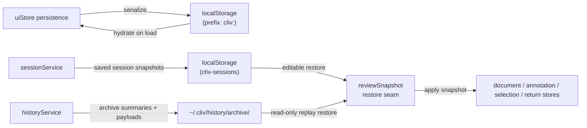

---

## Annotation Workflow

The annotation system is the heart of cliV's review experience. It allows users to highlight passages and attach contextual comments.

### Annotation Lifecycle

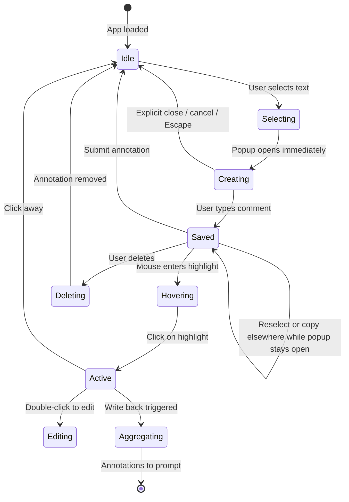

### Selection-to-Annotation Flow

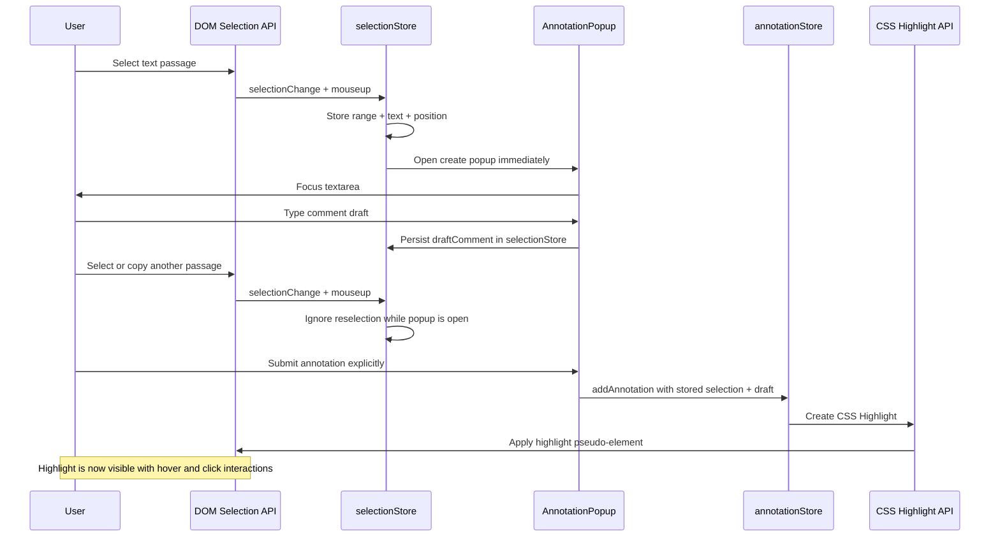

### Annotation Data Model

```typescript
interface Annotation {
  id: string;                  // UUID
  selectedText: string;        // The highlighted passage
  comment: string;             // User's annotation comment
  paragraphIndex: number;      // Which paragraph the selection is in
  startOffset: number;         // Character offset within paragraph
  endOffset: number;           // Character offset within paragraph
  createdAt: number;           // Timestamp (ms)
  color?: string;              // Highlight color (optional)
}
```

### Annotation Aggregation for Write-back

When the user triggers "Write back", all annotations are aggregated into a structured prompt:

```markdown
## Review Annotations

### Annotation 1
> Selected text: "The function uses a recursive approach..."
**Comment:** Consider using an iterative approach for better
stack safety with large inputs.

### Annotation 2
> Selected text: "Error handling is deferred to the caller..."
**Comment:** We should handle the FileNotFound case explicitly
here rather than propagating it.

### Annotation 3
> Selected text: "The cache is stored in memory..."
**Comment:** Should we add an LRU eviction policy for
long-running sessions?
```

---

## Review History

Submitted reviews are archived per workspace and can later be replayed as read-only review scenes.

### Session State Machine

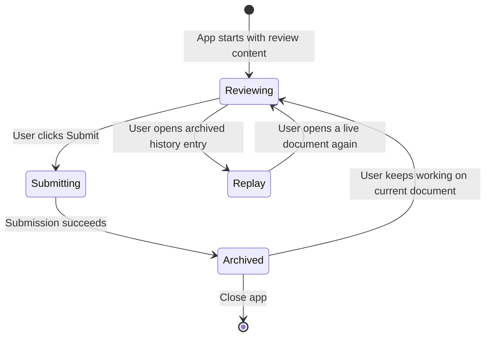

### Session Data Structure

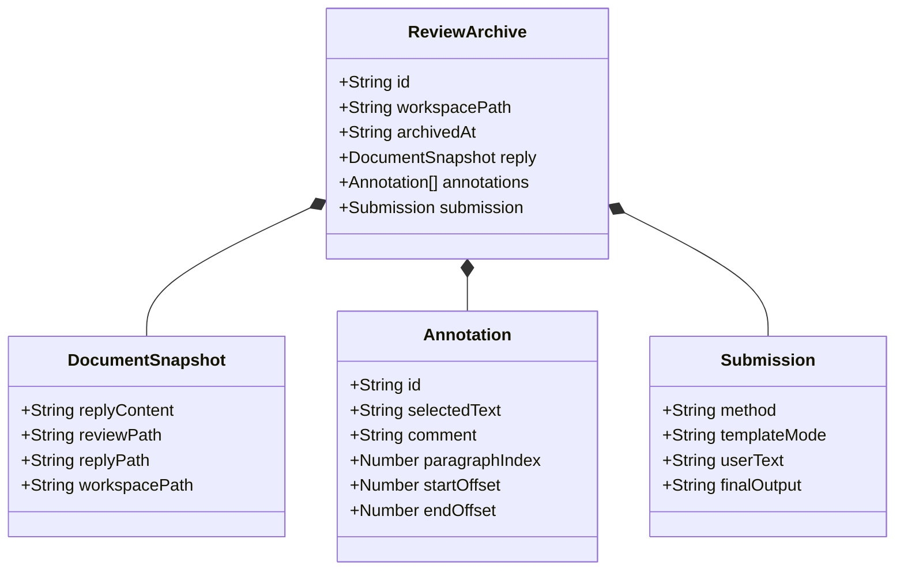

### Archive Storage Flow

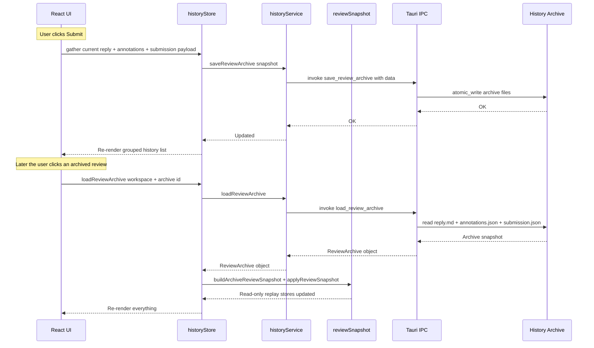

Saved local sessions use the same restore seam, but keep `localStorage` persistence and editable document state.

---

## Write-back & Return Flow

The return flow aggregates annotations into actionable feedback and delivers it back to the agent.

### Write-back Decision Tree

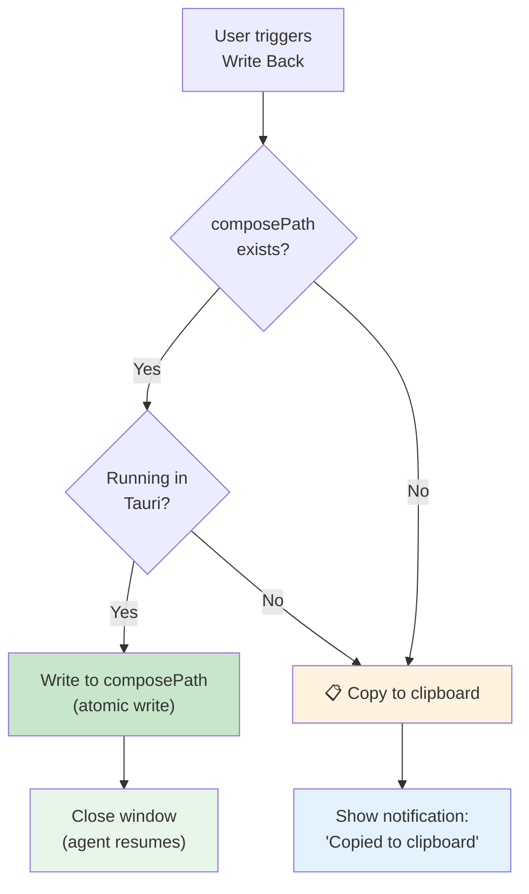

### Return Content Assembly

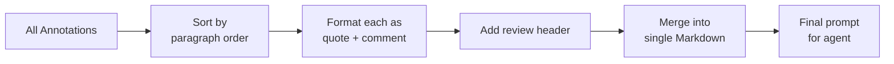

---

## Data Model Reference

### Entity Relationship Diagram

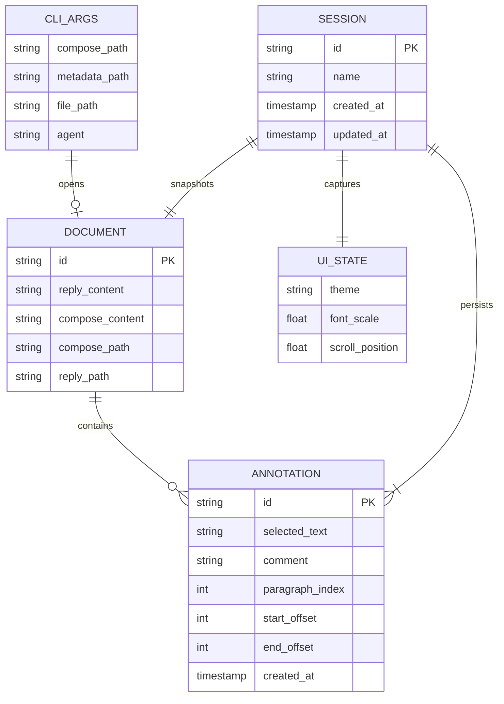

### Type Definitions

```typescript
// Core types used throughout the application

type Theme = "dark" | "muted" | "light";

interface UIState {
  theme: Theme;
  fontScale: number;          // 0.8 – 1.5
  sidebarOpen: boolean;
  sidebarTab: "annotations" | "sessions" | "overview";
  scrollPosition: number;
}

interface ReturnState {
  mode: "writeback" | "clipboard";
  pending: boolean;
  lastResult: "success" | "error" | null;
  aggregatedContent: string | null;
}

interface SelectionState {
  selectedText: string | null;
  selectionRange: Range | null;
  anchorPosition: { x: number; y: number } | null;
}
```

---

## Security & Reliability

### Defensive Design Patterns

cliV employs several defensive patterns to ensure reliability:

#### 1. Atomic File Writes

All file writes use a **write-to-tmp + rename** pattern to prevent data corruption:

```
write(path.tmp) → rename(path.tmp → path) → success
                ↘ on failure: remove(path.tmp) → log error
```

#### 2. Cascading Fallbacks

Reply discovery uses ordered fallback strategies:

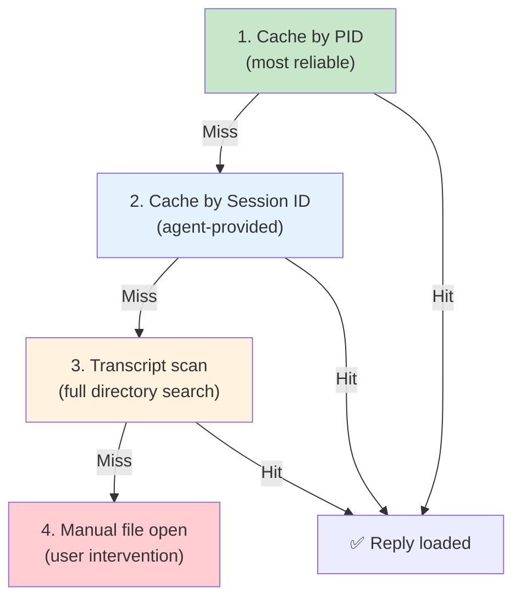

#### 3. Defensive Process Tree Walk

The parent process walk is bounded to **5 levels** and handles all failure modes:

```rust
for level in 0..5 {
    if pid <= 1 { break; }         // Reached init
    let comm = match read(...) {
        Ok(s) => s,
        Err(_) => break,           // Can't read → stop
    };
    if let Some(agent) = match_agent_name(&comm) {
        return Some(agent);        // Found!
    }
    pid = extract_ppid(pid)?;      // Walk up
}
// Exhausted 5 levels → None
```

#### 4. Best-Effort Logging

Logging never panics, never blocks, and always continues:

```rust
fn log(msg: &str) {
    let ts = SystemTime::now()
        .duration_since(UNIX_EPOCH)
        .map(|d| d.as_secs())
        .unwrap_or(0);
    if let Ok(mut f) = OpenOptions::new()
        .create(true).append(true)
        .open("/tmp/cliv.log")
    {
        let _ = writeln!(f, "[{}] {}", ts, msg);
    }
    // If anything fails, silently continue
}
```

### Error Handling Matrix

| Component | Error | Strategy |
|:---|:---|:---|
| Cache write | Disk full / permissions | Log + return (no crash) |
| Cache read | File missing | Fallback to next strategy |
| Agent detection | Process not found | Return None (unknown agent) |
| Stdin read | Empty / invalid JSON | Log + return early |
| IPC call | Tauri bridge error | Show error in UI |
| Clipboard | Access denied | Show notification |
| Session save | Write failure | Log + show error |

---

## Roadmap & Vision

### Current Status vs. Planned Features

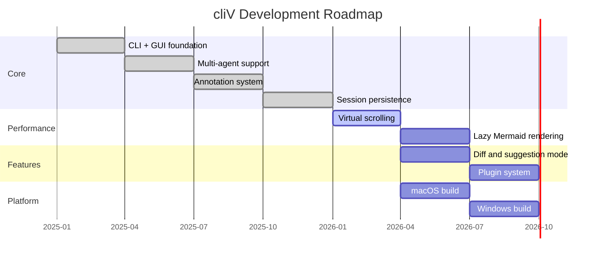

### Future Architecture Vision

```mermaid
graph TB
    subgraph "Current (v0.x)"
        direction TB
        C1["Single window"]
        C2["Local sessions"]
        C3["3 agents"]
    end

    subgraph "Near Future (v1.x)"
        direction TB
        F1["Virtual scrolling"]
        F2["Diff mode"]
        F3["Plugin API"]
    end

    subgraph "Long-term (v2.x)"
        direction TB
        L1["Multi-window"]
        L2["Cloud sync"]
        L3["Custom agent plugins"]
    end

    C1 --> F1
    C2 --> F2
    C3 --> F3
    F1 --> L1
    F2 --> L2
    F3 --> L3
```

---

## Appendix: Quick Reference

### Environment Variables

| Variable | Purpose | Example |
|:---|:---|:---|
| `EDITOR` | Set cliV as default editor | `export EDITOR="cliv"` |
| `CLIV_AGENT` | Force agent detection | `codex`, `claude`, `gemini` |
| `CODEX_THREAD_ID` | Active Codex cache key (compat name; usually the agent PID) | *(set by cliV or caller)* |
| `CODEX_HOME` | Codex config directory | `~/.codex` |
| `CLAUDE_SESSION_ID` | Claude session identifier | *(auto-set by Claude)* |
| `GEMINI_SESSION_ID` | Gemini session identifier | *(auto-set by Gemini)* |

### Key File Paths

| Path | Purpose |
|:---|:---|
| `~/.cliv/history/archive/` | Project-grouped archived reviews |
| `~/.codex/reply_cache/` | Cached Codex replies |
| `~/.claude/reply_cache/` | Cached Claude replies |
| `~/.gemini/reply_cache/` | Cached Gemini replies |
| `/tmp/cliv.log` | Diagnostic log file |

### CLI Usage

```bash
# Open a Markdown file for review
cliv document.md

# Cache an agent reply (called by hooks, not users)
cliv cache-codex '<json>'
cliv cache-claude          # reads from stdin
cliv cache-gemini          # reads from stdin

# Open with explicit compose target
cliv --compose /path/to/compose.md document.md

# Force specific agent detection
CLIV_AGENT=codex cliv document.md
```

### Tech Stack Summary

```mermaid
mindmap
  root((cliV))
    Frontend
      React 19
      Vite 7
      Zustand
      TailwindCSS 4
      react-markdown
      remark-gfm
      Mermaid.js
    Backend
      Tauri v2
      Rust
      serde_json
      dirs crate
    Integration
      Codex notify hook
      Claude Stop hook
      Gemini AfterAgent hook
    Storage
      File system cache
      localStorage
      Atomic writes

```

---

*This document was generated for demonstration purposes to showcase cliV's Markdown rendering capabilities, including headings, tables, code blocks, Mermaid diagrams (flowcharts, sequence diagrams, state diagrams, ER diagrams, Gantt charts, mind maps, class diagrams), blockquotes, and nested lists.*
