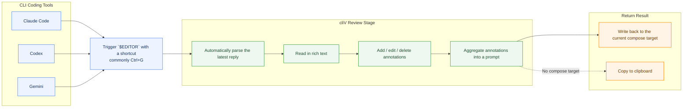

# cliV

> A desktop reviewer for long AI replies, used as `$EDITOR` for reading, annotation, aggregation, and return.

## Why cliV

In CLI coding tools like Claude Code, Codex, and Gemini, long replies are easy to generate but awkward to review carefully and even harder to annotate precisely.

cliV takes over the most uncomfortable part of that loop: you keep coding in the terminal, then when a reply needs close review, trigger `$EDITOR` with a shortcut and cliV automatically brings the latest reply into a desktop GUI, where you annotate, organize feedback, and send it back by write-back or clipboard.

## Core Capabilities

| Capability | Description |
|---|---|
| Used as `$EDITOR` | Common entry is `Ctrl+G` |
| Automatic last-reply parsing | Works with Claude Code, Codex, and Gemini |
| Selection-based annotation | Comment directly on specific passages |
| Multi-annotation aggregation | Turns annotations into a structured prompt |
| Write-back or copy | Writes back when a compose target exists, otherwise copies |
| Reading settings | One surface for theme, font size, layout memory, and reading presets |
| Submit return | `Ctrl+Enter` submits the result |

## Workflow



## Quick Start

### 1. Install cliV

Install cliV and make sure the `cliv` command is available in your terminal.

### 2. Set `$EDITOR`

```bash
export EDITOR="cliv"
```

If you want to override agent detection manually, set:

```bash
export CLIV_AGENT="codex"
```

Available values: `codex`, `claude`, `gemini`

### 3. Configure Agent Hooks

The snippets below are the minimum working examples.  
If your config file already contains other settings, merge these blocks instead of overwriting the whole file.

#### Codex

Edit `~/.codex/config.toml`:

```toml
notify = ["cliv", "cache-codex"]
```

If the file already has other settings, this is also valid:

```toml
model = "o4-mini"
notify = ["cliv", "cache-codex"]
```

On macOS, if `cliv` is not in PATH, use:

```toml
notify = ["/Applications/cliV.app/Contents/MacOS/cliv", "cache-codex"]
```

Keep notify for compatibility, and create `~/.codex/hooks.json` to capture Plan Review content:

```json
{
  "hooks": {
    "Stop": [
      {
        "hooks": [
          {
            "type": "command",
            "command": "cliv cache-codex",
            "timeout": 5,
            "statusMessage": "Caching reply for cliV"
          }
        ]
      }
    ]
  }
}
```

Use `/hooks` in Codex to review and trust the command. If inline hooks already exist in `config.toml`, merge the Stop handler there instead of maintaining both hook formats. On macOS without a symlink, use the full cliV executable path in `command` too.

Codex's Plan decision dialog currently captures keyboard input, so `Ctrl+G` does not launch `$EDITOR` inside that dialog. Choose No to return to the normal composer, then press `Ctrl+G`; cliV will load the plan captured by the Stop hook.

#### Claude Code

Edit `~/.claude/settings.json` and merge this into your existing config:

```json
{
  "hooks": {
    "Stop": [
      {
        "hooks": [
          {
            "type": "command",
            "command": "cliv cache-claude"
          }
        ]
      }
    ]
  }
}
```

On macOS, if `cliv` is not in PATH, use:

```json
{
  "hooks": {
    "Stop": [
      {
        "hooks": [
          {
            "type": "command",
            "command": "/Applications/cliV.app/Contents/MacOS/cliv cache-claude"
          }
        ]
      }
    ]
  }
}
```

#### Gemini CLI

Edit `~/.gemini/settings.json` and merge this into your existing config:

```json
{
  "hooks": {
    "AfterAgent": [
      {
        "hooks": [
          {
            "type": "command",
            "command": "cliv cache-gemini"
          }
        ]
      }
    ]
  }
}
```

On macOS, if `cliv` is not in PATH, use:

```json
{
  "hooks": {
    "AfterAgent": [
      {
        "hooks": [
          {
            "type": "command",
            "command": "/Applications/cliV.app/Contents/MacOS/cliv cache-gemini"
          }
        ]
      }
    ]
  }
}
```

### 4. Start Using It

1. Finish a turn in Claude Code, Codex, or Gemini so the agent produces a long reply
2. Trigger `$EDITOR` with a shortcut, commonly `Ctrl+G`
3. cliV starts automatically and loads the latest reply
4. Select the passages you want to address and the annotation box opens immediately with focus
5. Choose a type: comment, question, rewrite, or challenge
6. Type and press `Ctrl+Enter`; if you select or copy another passage meanwhile, the current draft stays unchanged until you explicitly submit or close it
7. When you're done, cliV aggregates the annotations into a prompt
8. If a compose target exists, cliV writes back directly; otherwise it copies to the clipboard
9. Go back to your coding tool and continue the next iteration

## One-line Summary

cliV is not another chat window. It is a desktop review surface for long AI coding-agent replies.
