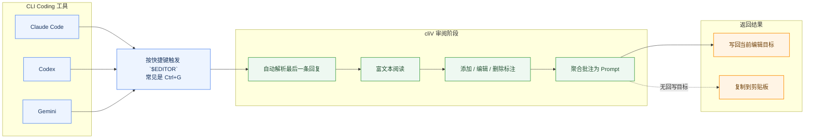

# cliV

> AI 长回复审阅器，作为 `$EDITOR` 使用，完成阅读、批注、聚合和返回。

## 为什么用 cliV

在 Claude Code、Codex、Gemini 这类 CLI coding 工具里，长回复能生成出来，但不适合精读，也不适合做精确批注。

cliV 把这段最别扭的流程接走：你在终端里继续写代码，在需要精读时，按快捷键触发 `$EDITOR`，自动把最新回复带到桌面 GUI，做标注、整理意见，再直接写回当前线程或复制返回。

## 核心能力

| 能力 | 说明 |
|---|---|
| 作为 `$EDITOR` 使用 | 常见入口是 `Ctrl+G` |
| 自动解析最后一条回复 | 面向 Claude Code、Codex、Gemini |
| 选区批注 | 直接对具体段落加意见 |
| 多批注聚合 | 自动整理成结构化 Prompt |
| 写回或复制 | 有 compose target 就写回，没有就复制 |
| 阅读设置 | 统一调整主题、字号、布局和高亮预设 |
| 提交返回 | `Ctrl+Enter` 提交结果 |

## 工作流



## 快速开始

### 1. 安装 cliV

下载安装 cliV，并确保命令 `cliv` 在终端可用。

### 2. 设置 `$EDITOR`

```bash
export EDITOR="cliv"
```

如需手动覆盖 Agent 识别，可设置：

```bash
export CLIV_AGENT="codex"
```

可选值：`codex`、`claude`、`gemini`

### 3. 配置 Agent 回调

下面给的是可直接照抄的最小可用配置。  
如果你的配置文件里已经有其他内容，请把下面片段合并进去，不要整文件覆盖。

#### Codex

编辑 `~/.codex/config.toml`：

```toml
notify = ["cliv", "cache-codex"]
```

如果文件里已有其他配置，可参考：

```toml
model = "o4-mini"
notify = ["cliv", "cache-codex"]
```

如果是 macOS，且 `cliv` 不在 PATH 里，可改成：

```toml
notify = ["/Applications/cliV.app/Contents/MacOS/cliv", "cache-codex"]
```

保留 notify 用于兼容，并创建 `~/.codex/hooks.json` 来捕获 Plan Review 内容：

```json
{
  "hooks": {
    "Stop": [
      {
        "hooks": [
          {
            "type": "command",
            "command": "cliv cache-codex",
            "timeout": 5,
            "statusMessage": "Caching reply for cliV"
          }
        ]
      }
    ]
  }
}
```

在 Codex 中使用 `/hooks` 审核并信任该命令。如果 `config.toml` 已经有 inline Hooks，请把 Stop handler 合并进去，不要同时维护两种 Hook 格式。macOS 未创建软链接时，`command` 也要使用 cliV 的完整可执行路径。

Codex 的 Plan 决策弹窗当前会接管键盘输入，因此在弹窗内按 `Ctrl+G` 不会启动 `$EDITOR`。选择 No 回到普通输入框后再按 `Ctrl+G`，cliV 会加载 Stop Hook 已捕获的计划。

#### Claude Code

编辑 `~/.claude/settings.json`，把下面内容合并进现有配置：

```json
{
  "hooks": {
    "Stop": [
      {
        "hooks": [
          {
            "type": "command",
            "command": "cliv cache-claude"
          }
        ]
      }
    ]
  }
}
```

如果是 macOS，且 `cliv` 不在 PATH 里，可改成：

```json
{
  "hooks": {
    "Stop": [
      {
        "hooks": [
          {
            "type": "command",
            "command": "/Applications/cliV.app/Contents/MacOS/cliv cache-claude"
          }
        ]
      }
    ]
  }
}
```

#### Gemini CLI

编辑 `~/.gemini/settings.json`，把下面内容合并进现有配置：

```json
{
  "hooks": {
    "AfterAgent": [
      {
        "hooks": [
          {
            "type": "command",
            "command": "cliv cache-gemini"
          }
        ]
      }
    ]
  }
}
```

如果是 macOS，且 `cliv` 不在 PATH 里，可改成：

```json
{
  "hooks": {
    "AfterAgent": [
      {
        "hooks": [
          {
            "type": "command",
            "command": "/Applications/cliV.app/Contents/MacOS/cliv cache-gemini"
          }
        ]
      }
    ]
  }
}
```

### 4. 开始使用

1. 在 Claude Code、Codex 或 Gemini 中完成一轮对话，让 agent 生成一条长回复
2. 按快捷键触发 `$EDITOR`，常见是 `Ctrl+G`
3. cliV 自动启动并加载最后一条回复
4. 在文中选中需要处理的段落，批注框会立刻弹出并自动聚焦
5. 选择类型：批注、提问、重写、质疑
6. 输入内容后按 `Ctrl+Enter` 提交；如果中途再划选或复制别处内容，当前批注草稿会保持不变，直到你显式提交或关闭
7. 完成后，cliV 会自动聚合批注为 Prompt
8. 有回写目标时直接写回；没有时复制到剪贴板
9. 回到 coding 工具，继续下一轮协作

## 一句话总结

cliV 不是另一个聊天窗口，而是 AI coding agent 长回复的桌面审阅台。
